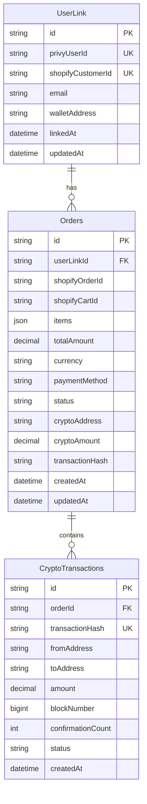

# データベース設計

## 🗄️ 概要

データベース設計書とスキーマを格納するフォルダです。

## 📄 ドキュメント一覧

### **設計書**
- データベーススキーマ（今後追加予定）
- ER図（今後追加予定）
- マイグレーション設計（今後追加予定）

## 🏗️ データベース構成

### **使用技術**
- **データベース**: PostgreSQL
- **ORM**: Prisma
- **マイグレーション**: Prisma Migrate

### **主要テーブル**

#### **UserLink**
```sql
-- PrivyユーザーとShopifyカスタマーの紐付け
CREATE TABLE user_links (
  id                UUID PRIMARY KEY DEFAULT gen_random_uuid(),
  privy_user_id     VARCHAR(255) UNIQUE NOT NULL,
  shopify_customer_id VARCHAR(255) UNIQUE NOT NULL,
  email             VARCHAR(255) NOT NULL,
  wallet_address    VARCHAR(255),
  linked_at         TIMESTAMP DEFAULT NOW(),
  updated_at        TIMESTAMP DEFAULT NOW()
);
```

#### **Orders**
```sql
-- 注文管理
CREATE TABLE orders (
  id                UUID PRIMARY KEY DEFAULT gen_random_uuid(),
  user_link_id      UUID REFERENCES user_links(id),
  shopify_order_id  VARCHAR(255),
  shopify_cart_id   VARCHAR(255),
  items             JSONB NOT NULL,
  total_amount      DECIMAL(18,8) NOT NULL,
  currency          VARCHAR(10) NOT NULL,
  payment_method    VARCHAR(20) NOT NULL,
  status            VARCHAR(20) NOT NULL,
  crypto_address    VARCHAR(255),
  crypto_amount     DECIMAL(18,8),
  transaction_hash  VARCHAR(255),
  created_at        TIMESTAMP DEFAULT NOW(),
  updated_at        TIMESTAMP DEFAULT NOW()
);
```

#### **CryptoTransactions**
```sql
-- 仮想通貨トランザクション
CREATE TABLE crypto_transactions (
  id                UUID PRIMARY KEY DEFAULT gen_random_uuid(),
  order_id          UUID REFERENCES orders(id),
  transaction_hash  VARCHAR(255) UNIQUE NOT NULL,
  from_address      VARCHAR(255) NOT NULL,
  to_address        VARCHAR(255) NOT NULL,
  amount            DECIMAL(18,8) NOT NULL,
  block_number      BIGINT,
  confirmation_count INTEGER DEFAULT 0,
  status            VARCHAR(20) DEFAULT 'PENDING',
  created_at        TIMESTAMP DEFAULT NOW()
);
```

## 📊 データモデル

### **エンティティ関係**



## 🔧 Prismaスキーマ

```prisma
// schema.prisma
generator client {
  provider = "prisma-client-js"
}

datasource db {
  provider = "postgresql"
  url      = env("DATABASE_URL")
}

model UserLink {
  id                String   @id @default(cuid())
  privyUserId       String   @unique
  shopifyCustomerId String   @unique
  email             String
  walletAddress     String?
  linkedAt          DateTime @default(now())
  updatedAt         DateTime @updatedAt

  orders            Order[]
  
  @@map("user_links")
}

model Order {
  id                String   @id @default(cuid())
  userLinkId        String?
  userLink          UserLink? @relation(fields: [userLinkId], references: [id])
  
  // Shopify関連
  shopifyOrderId    String?
  shopifyCartId     String?
  
  // カート情報
  items             Json
  totalAmount       Decimal
  currency          String
  paymentMethod     String
  status            OrderStatus
  
  // 仮想通貨関連
  cryptoAddress     String?
  cryptoAmount      Decimal?
  transactionHash   String?
  
  // タイムスタンプ
  createdAt         DateTime @default(now())
  updatedAt         DateTime @updatedAt
  
  cryptoTransactions CryptoTransaction[]
  
  @@map("orders")
}

model CryptoTransaction {
  id                String   @id @default(cuid())
  orderId           String
  order             Order    @relation(fields: [orderId], references: [id])
  transactionHash   String   @unique
  fromAddress       String
  toAddress         String
  amount            Decimal
  blockNumber       BigInt?
  confirmationCount Int      @default(0)
  status            TransactionStatus @default(PENDING)
  createdAt         DateTime @default(now())
  
  @@map("crypto_transactions")
}

enum OrderStatus {
  PENDING_PAYMENT
  PAYMENT_RECEIVED
  SHIPPED
  DELIVERED
  CANCELLED
}

enum TransactionStatus {
  PENDING
  CONFIRMED
  FAILED
}
```

## 🚀 マイグレーション

### **初期マイグレーション**
```bash
# マイグレーションファイル生成
npx prisma migrate dev --name init

# データベース同期
npx prisma db push

# クライアント生成
npx prisma generate
```

### **マイグレーション管理**
```bash
# 新しいマイグレーション作成
npx prisma migrate dev --name add_user_links

# 本番環境マイグレーション
npx prisma migrate deploy

# マイグレーションリセット
npx prisma migrate reset
```

## 📊 インデックス設計

### **パフォーマンス最適化**
```sql
-- ユーザー検索用インデックス
CREATE INDEX idx_user_links_privy_user_id ON user_links(privy_user_id);
CREATE INDEX idx_user_links_shopify_customer_id ON user_links(shopify_customer_id);
CREATE INDEX idx_user_links_email ON user_links(email);

-- 注文検索用インデックス
CREATE INDEX idx_orders_user_link_id ON orders(user_link_id);
CREATE INDEX idx_orders_status ON orders(status);
CREATE INDEX idx_orders_created_at ON orders(created_at);

-- トランザクション検索用インデックス
CREATE INDEX idx_crypto_transactions_order_id ON crypto_transactions(order_id);
CREATE INDEX idx_crypto_transactions_hash ON crypto_transactions(transaction_hash);
CREATE INDEX idx_crypto_transactions_status ON crypto_transactions(status);
```

## 🔐 セキュリティ

### **データ保護**
- 機密データの暗号化
- アクセスログの記録
- 定期的なバックアップ

### **アクセス制御**
- データベースユーザー権限管理
- 接続文字列の安全な管理
- ネットワークアクセス制御

---

**最終更新**: 2024年9月20日
