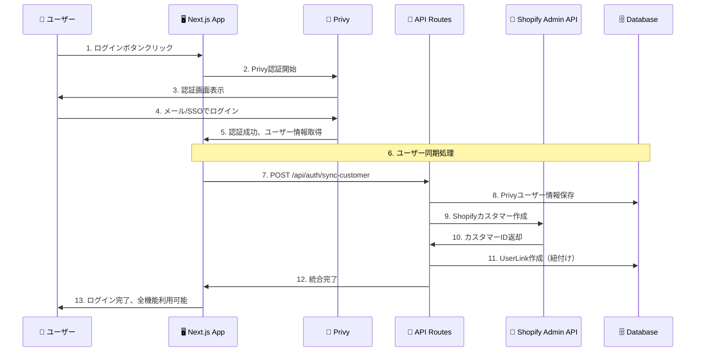
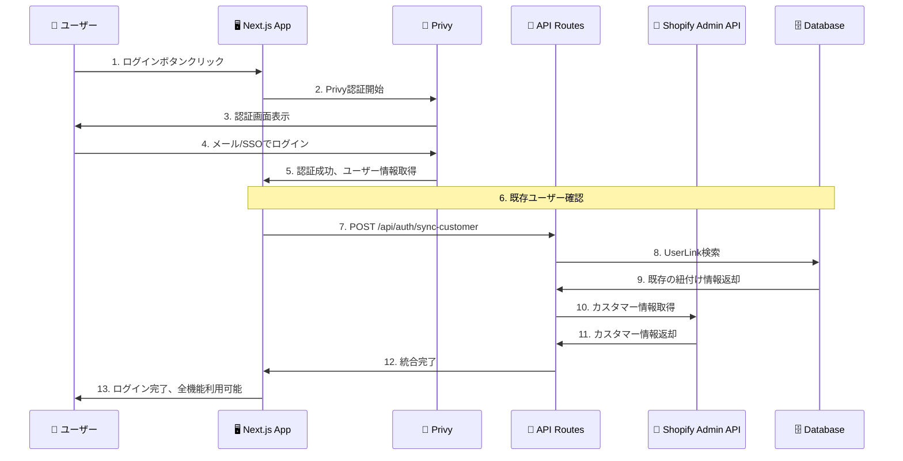
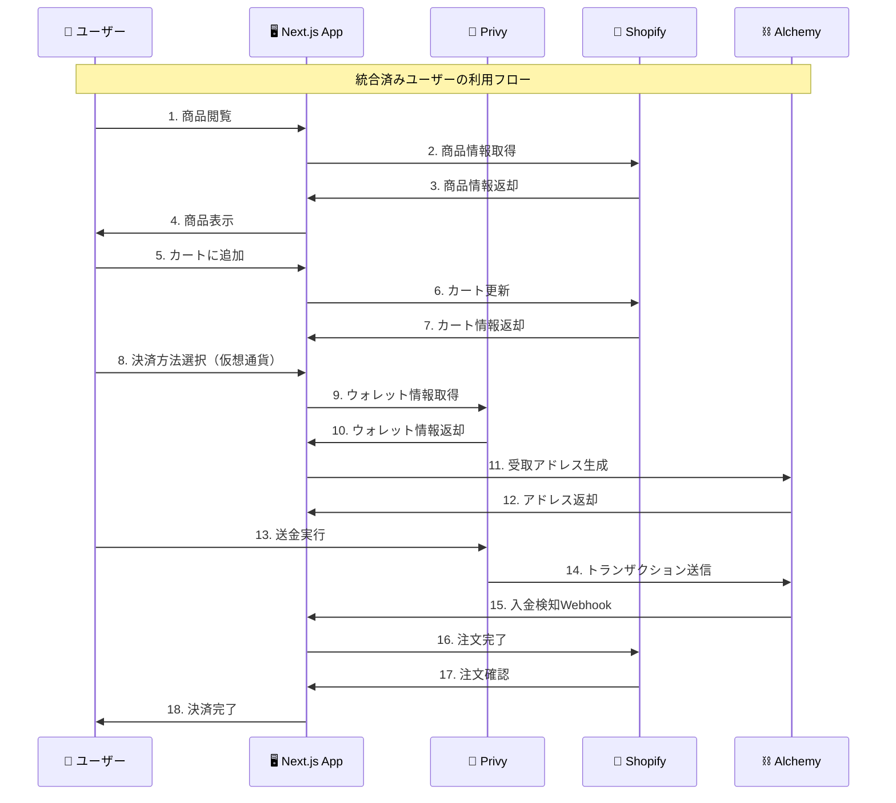

# Privy + Shopify ログイン統合シーケンス図

## 🔐 統合の概要

PrivyのログインとShopifyのログインを統合することで、ユーザーは一度のログインで両方のサービスを利用できるようになります。

## 📊 統合シーケンス図

### **1. 初回ログイン（新規ユーザー）**



### **2. 再ログイン（既存ユーザー）**



### **3. 統合後の利用フロー**



## 🔧 技術的な実装詳細

### **1. 認証統合の仕組み**

#### **Privy側の処理**
```typescript
// Privy認証完了後の処理
const { user, isReady } = usePrivy();

useEffect(() => {
  if (isReady && user) {
    // ユーザー情報をAPIに送信
    syncUserWithShopify(user);
  }
}, [user, isReady]);

const syncUserWithShopify = async (privyUser: any) => {
  const response = await fetch('/api/auth/sync-customer', {
    method: 'POST',
    headers: { 'Content-Type': 'application/json' },
    body: JSON.stringify({
      privyUserId: privyUser.id,
      email: privyUser.email?.address,
      walletAddress: privyUser.wallet?.address
    })
  });
  
  const result = await response.json();
  // 統合完了、Shopify機能も利用可能
};
```

#### **API側の処理**
```typescript
// /api/auth/sync-customer
export async function POST(request: NextRequest) {
  const { privyUserId, email, walletAddress } = await request.json();
  
  // 既存のUserLinkを検索
  let userLink = await prisma.userLink.findUnique({
    where: { privyUserId }
  });
  
  if (!userLink) {
    // 新規ユーザー：Shopifyカスタマーを作成
    const shopifyCustomer = await createShopifyCustomer({
      email,
      walletAddress
    });
    
    // UserLinkを作成
    userLink = await prisma.userLink.create({
      data: {
        privyUserId,
        shopifyCustomerId: shopifyCustomer.id,
        email,
        walletAddress
      }
    });
  }
  
  return NextResponse.json({ userLink });
}
```

### **2. データベース設計**

#### **UserLinkテーブル**
```sql
CREATE TABLE user_links (
  id                UUID PRIMARY KEY DEFAULT gen_random_uuid(),
  privy_user_id     VARCHAR(255) UNIQUE NOT NULL,
  shopify_customer_id VARCHAR(255) UNIQUE NOT NULL,
  email             VARCHAR(255) NOT NULL,
  wallet_address    VARCHAR(255),
  linked_at         TIMESTAMP DEFAULT NOW(),
  updated_at        TIMESTAMP DEFAULT NOW()
);
```

### **3. 統合のメリット**

#### **ユーザー体験の向上**
- **シングルサインオン**: 一度のログインで全機能利用
- **統合されたデータ**: 購入履歴とウォレット情報の一元管理
- **シームレスな決済**: カートから決済まで一貫した体験

#### **開発効率の向上**
- **認証の一元化**: 複数の認証システムを管理不要
- **データの整合性**: ユーザー情報の重複排除
- **保守性の向上**: 認証ロジックの集約

## 🚀 実装手順

### **Phase 1: 基盤構築**
1. UserLinkテーブルの作成
2. 認証APIの実装
3. Privy統合の実装

### **Phase 2: 統合テスト**
1. 新規ユーザーの統合テスト
2. 既存ユーザーの統合テスト
3. エラーハンドリングのテスト

### **Phase 3: 本番デプロイ**
1. 本番環境でのテスト
2. ユーザーフィードバックの収集
3. パフォーマンス最適化

## 🔐 セキュリティ考慮事項

### **データ保護**
- ユーザー情報の暗号化
- プライベートキーの安全な管理
- 通信の暗号化

### **認証セキュリティ**
- JWT Token認証
- セッション管理
- 不正アクセス防止

### **監査ログ**
- 認証ログの記録
- データアクセスログ
- セキュリティインシデント対応

---

**最終更新**: 2024年9月20日
